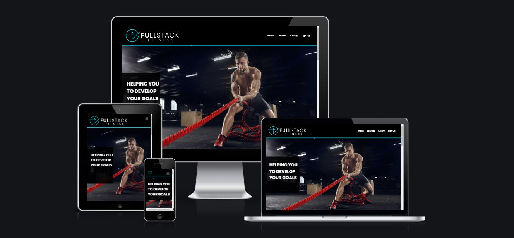
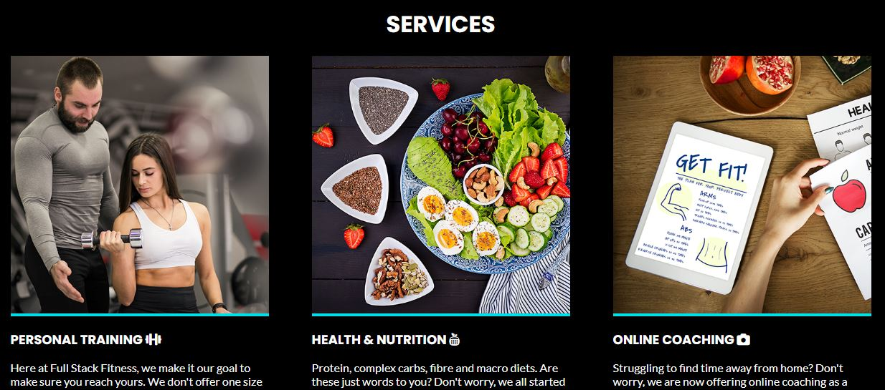
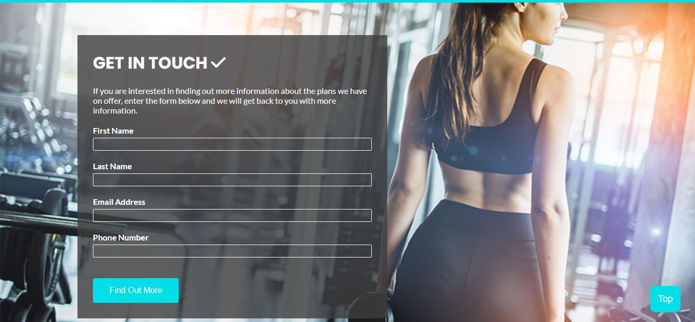
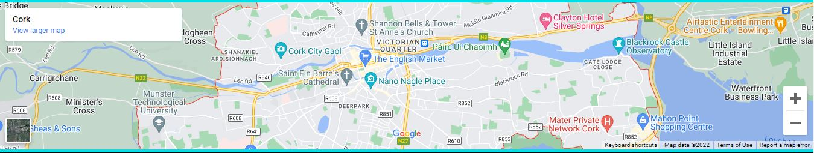
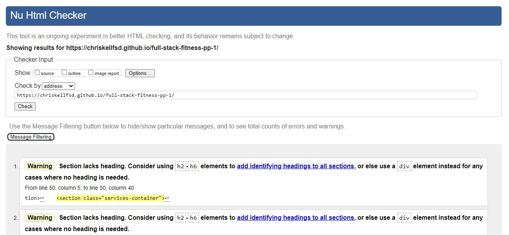
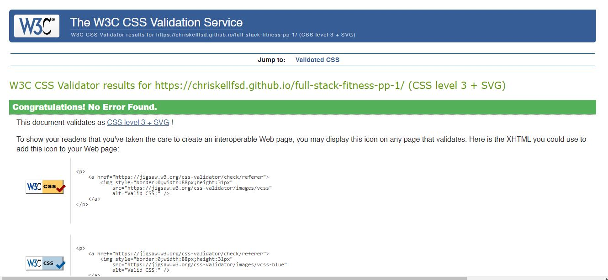
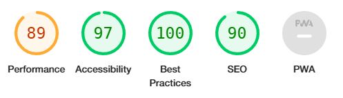

# Full Stack Fitness
  

Full Stack Fitness is a personal training/GYM website. It offers various services from personal training, online coacing and health & nutritional food planning. The aim of the website is to show a combination of sound HTML & CSS skills as well as clear design fundamentals with UX/UI design in mind.

---
## UX
   This website was designed as a single page website with the aim of being clear and concise. It utilises sound user experience design, with a  aim of giving the user all the information it needs without the need of multiple pages.

  **Wireframe**

   Prior to code being writte, I planned out the design and layout of the site using https://www.lucidchart.com/.
    
   
   **Design**

   I created the logo for Full Stack Fitness with colours that would contrast well against a black background. I used adobe illustrator to do this. 

  

  **Colour Scheme**

   I used black and a cyan blue as the two main colours for the website. This combined with white for the text colour, really made a website that contrasted well.
    

  **Typography**

   The fonts I used for this was 'Poppins' for the main headings and 'Lato' for the body of text.

   Fonts were downloaded from https://fonts.google.com/

   I also used icons in the services, signup and footer section.

   Icons were used from https://fontawesome.com/

   --- 

## Features
**Navigation**
   * The entire website is a single HTML page. 
   * Featured at the top of the page is a navigation bar which shows the Full Stack Fitness logo on the left side.
   * On the right hand side there are 4 links; Home, Services, Gallery and Sign-Up. These link to various sections on the page.
   * The logo and colour scheme was designed to to contrast well against a black background.
   * The navigation is designed to be clear and consise with the information for the website.
   

   **Services**
   * The services section gives the user an idea of the main types of services they can expect from this gym.
   * It is layed out in 3 columns, with clear imagery supported by relevant text.
   

**Gallery**
   * The gallery section just had 5 images but is not only an area to showcase the high quality images of the gym but also acts as a design feature that compliments the flow of the site as well as seperating the services and sign-up section.
   

   **Sign-Up Form**
   * The sign up form is used to collect data from new users who are seeking information about the product and/or services the gym can provide.
   * The form collects the users First name, last name, email address and phone number.
   * The submit button text is replaced with 'find out more' to act as a friendly call to action.
   

   **Google Maps**
   * A google maps section was embedded so the user could quickly check location of the gym in relation to their area.
   * It was placed right below the sign up section so the user could check it as they were deciding whether or not to fill out the form.
   

   **Footer**
   * The footer section is small and does not hold a lot of additional information within it. It doesn provide the user the option to check out the gyms social media accounts.
   * At the moment, these link to the main social media company's homepage.
   

  **Scroll to the top button**
   * I implemented a scroll to the top button to assist the user with the flow of the website in case they wanted to reach the top of the page quickly.

   

   ---

## Testing

* I tested that this website works in different browsers: Chrome, Firefox, Safari
* I confirmed that this project is responsive on various screen sizes using chrome developer tools.
* I confirmed that all the text is easily read and the contrast of the website is clear.
* I have tested that the signup form works and requires all fields to be filled out before it can be submitted.

**Validators**
* The html was validated with Nu HTML Checker.

* CSS was validated using W3C CSS Validator.

* Lighthouse was used in chrome dev tools to assess its varying perfomance indicators.

   
   ---

## Technologies used
   * HTML
   * CSS
   * Javascript
   * Adobe Illustrator
   * Adobe Photoshop
   * Google Fonts
   * Font Awesome

   ---

## Deployment
  * The site was deployed to GitHub pages by using the following steps:
    * In the GitHub repository, navigate over to the settings tab
    * From there, click on the 'Pages' tab.
    * Then click on the source section and select the Master Branch.
    * Once you have clicked on Master Branch, a live link of the website will be provided for you.

  * You can find the link to the live website here: https://chriskellfsd.github.io/full-stack-fitness-pp-1/

---

   ## Credits
   **Media**
   * The images that were used on the site were all sourced from https://freepik.com/

   **Content**
   * The code for the Nav Bar was adapted from the following tutorial: https://www.youtube.com/watch?v=At4B7A4GOPg 
   * The services section was done using grid, learned mainly from playing the css game: https://cssgridgarden.com/
   * The footer section code was used from the CI <a href="https://github.com/ChrisKellFSD/love-running">Love Running</a> Project.
   * The scroll back to the top button was adapted from: https://www.w3schools.com/howto/howto_js_scroll_to_top.asp

   ---

   **Acknowledgements**
   * I would like to thank <a href="https://github.com/10xOXR">Chris Quinn</a> for helping me throughout this project. His guide and insight helped me greatly along the way and it is very much appreciated.

   